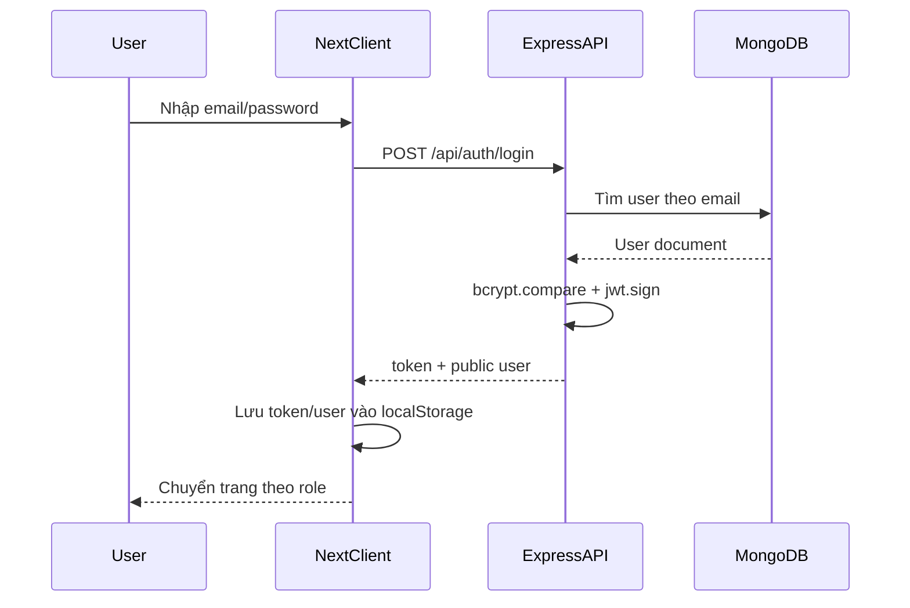
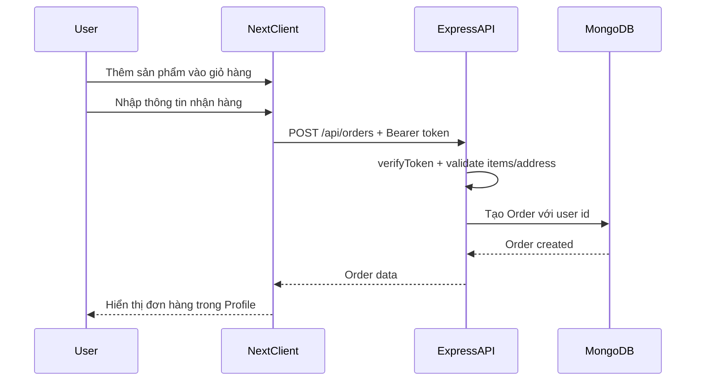
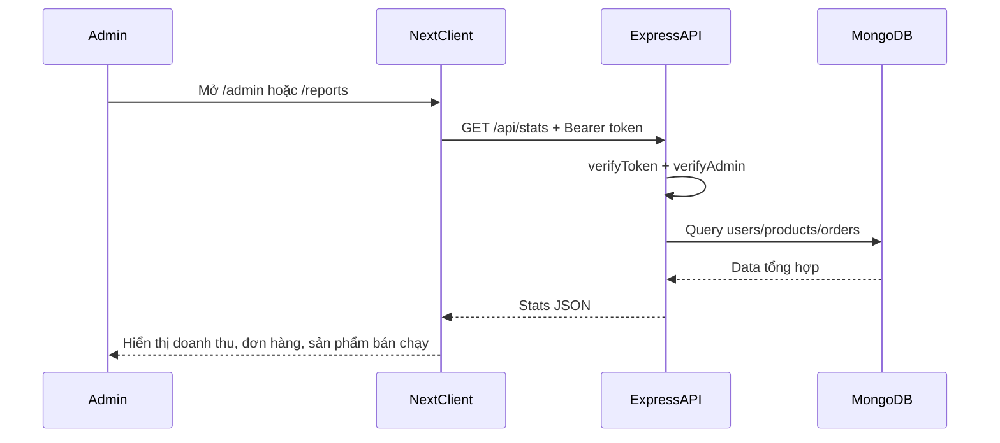
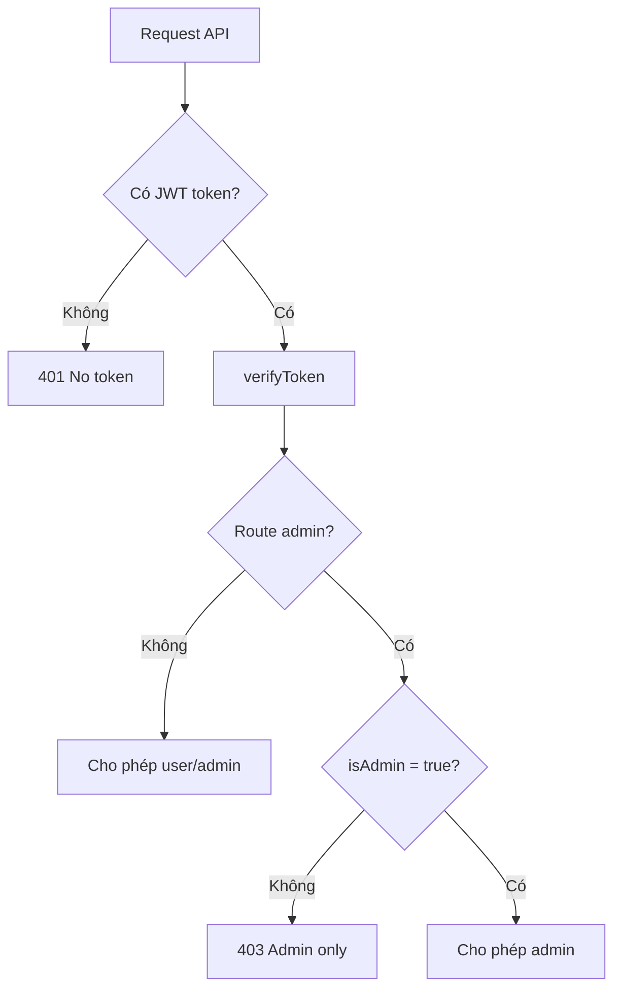

# Diagram kiến trúc

## 1. Kiến trúc tổng thể

```mermaid
flowchart LR
  U[User/Admin Browser] --> FE[Next.js Client]
  FE -->|REST API / fetch| BE[Express.js Server]
  BE -->|Mongoose| DB[(MongoDB Local - shopdb)]
  BE --> UP[Local Uploads Folder]

  FE --> PAGES[App Router Pages]
  PAGES --> HOME[Home / Products / Product Detail]
  PAGES --> AUTH[Login / Register / Profile]
  PAGES --> ADMIN[Admin Dashboard]

  BE --> AUTHAPI[Auth API]
  BE --> PRODUCTAPI[Product API]
  BE --> ORDERAPI[Order API]
  BE --> USERAPI[User API]
  BE --> STATSAPI[Stats API]
  BE --> UPLOADAPI[Upload API]
```

## 2. Luồng đăng nhập

## 3. Luồng đặt hàng

## 4. Luồng admin dashboard

## 5. Phân quyền

## 6. Ghi chú triển khai

- Frontend dùng Next.js App Router.
- Backend tách riêng bằng Express.js.
- Database dùng MongoDB local, import dữ liệu bằng `npm run seed`.
- Upload ảnh lưu tại `server/uploads` và public qua `/uploads/...`.
- Admin-only API gồm: products create/update/delete, users CRUD, orders list/update, stats, upload.
