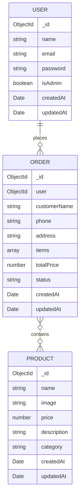

# ERD hoặc Schema Data

## 1. Tổng quan database

Database mặc định:

```txt
shopdb
```

Collections chính:

```txt
users
products
orders
```

## 2. ERD đơn giản



## 3. User Schema

Model file:

```txt
server/models/User.js
```

| Field | Type | Required | Mô tả |
|---|---|---:|---|
| `_id` | ObjectId | Auto | ID người dùng |
| `name` | String | Có | Tên người dùng |
| `email` | String | Có, unique | Email đăng nhập |
| `password` | String | Có | Mật khẩu đã hash bằng bcrypt |
| `isAdmin` | Boolean | Không | Phân quyền admin/user |
| `createdAt` | Date | Auto | Ngày tạo |
| `updatedAt` | Date | Auto | Ngày cập nhật |

Ví dụ document:

```json
{
  "_id": "69dc7a1996d0ed80e07c4cb8",
  "name": "Quan",
  "email": "admin@test.com",
  "password": "$2b$10$...",
  "isAdmin": true,
  "createdAt": "2026-04-13T05:07:37.202Z",
  "updatedAt": "2026-04-13T05:07:37.202Z"
}
```

## 4. Product Schema

Model file:

```txt
server/models/Product.js
```

| Field | Type | Required | Mô tả |
|---|---|---:|---|
| `_id` | ObjectId | Auto | ID sản phẩm |
| `name` | String | Không bắt buộc trong schema hiện tại | Tên sản phẩm |
| `image` | String | Không | URL ảnh hoặc path `/uploads/...` |
| `price` | Number | Không | Giá sản phẩm |
| `description` | String | Không | Mô tả sản phẩm |
| `category` | String | Không | Danh mục sản phẩm |
| `createdAt` | Date | Auto | Ngày tạo |
| `updatedAt` | Date | Auto | Ngày cập nhật |

Danh mục đang dùng:

```txt
shirt, pants, hoodie, shoes
```

Ví dụ document:

```json
{
  "_id": "6a095ccbdf5d6bf6de075485",
  "name": "Áo Nam basic",
  "image": "http://localhost:5000/uploads/ao1.jpg",
  "price": 20000,
  "description": "áo nam basic hợp thời trang hợp với người basic",
  "category": "shirt"
}
```

## 5. Order Schema

Model file:

```txt
server/models/Order.js
```

| Field | Type | Required | Mô tả |
|---|---|---:|---|
| `_id` | ObjectId | Auto | ID đơn hàng |
| `user` | ObjectId ref User | Có khi user đăng nhập đặt hàng | Người đặt hàng |
| `customerName` | String | Có ở API | Tên người nhận |
| `phone` | String | Có ở API | Số điện thoại |
| `address` | String | Có ở API | Địa chỉ nhận hàng |
| `items` | Array | Có | Danh sách sản phẩm đã mua |
| `totalPrice` | Number | Có | Tổng tiền |
| `status` | String | Không | Trạng thái đơn, default `Pending` |
| `createdAt` | Date | Auto | Ngày tạo |
| `updatedAt` | Date | Auto | Ngày cập nhật |

Trạng thái đơn hàng:

```txt
Pending, Processing, Shipping, Completed, Cancelled
```

Cấu trúc `items` trong đơn hàng:

```json
[
  {
    "_id": "6a096005df5d6bf6de075489",
    "name": "áo sơ mi",
    "image": "http://localhost:5000/uploads/aosomi.jpg",
    "price": 500000,
    "description": "áo sơ mi lịch sự phù hợp với người đi làm",
    "category": "shirt",
    "qty": 2
  }
]
```

## 6. Quan hệ dữ liệu

- Một user có thể có nhiều orders.
- Một order thuộc về một user thông qua field `user`.
- Một order chứa nhiều sản phẩm trong field `items`.
- Field `items` đang lưu snapshot sản phẩm tại thời điểm mua, giúp đơn hàng vẫn hiển thị đúng tên/giá/số lượng dù sản phẩm gốc bị sửa sau đó.

## 7. Ghi chú về dữ liệu seed

Dữ liệu seed nằm ở:

```txt
server/seed/users.json
server/seed/products.json
server/seed/orders.json
```

Chạy seed:

```bash
cd server
npm run seed
```
